# 📊 AI-Powered Fraud Detection and Banking Assistant — All Report Diagrams

> **Instructions for use:**
> 1. Push this file to your GitHub repo as `DIAGRAMS_FOR_REPORT.md`
> 2. Open it on GitHub (not VS Code) — GitHub renders Mermaid natively
> 3. Take screenshots of each diagram section for your report
> 4. Page references from report are noted beside each figure title

---

## Figure 1.1 — Growth of Digital Payment Fraud in India (2019–2024)
> *Used in Chapter 1, Page 2*

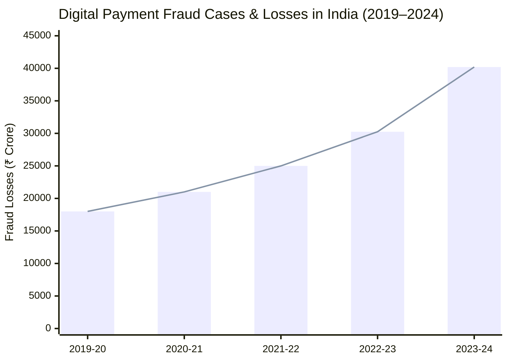
```mermaid
xychart-beta
    title "Digital Payment Fraud Cases & Losses in India (2019–2024)"
    x-axis ["2019-20", "2020-21", "2021-22", "2022-23", "2023-24"]
    y-axis "Fraud Losses (₹ Crore)" 0 --> 45000
    bar [18000, 21000, 25000, 30252, 40200]
    line [18000, 21000, 25000, 30252, 40200]
```

> **Source:** RBI Report on Trend and Progress of Banking in India (2022-23); I4C Annual Report (2023-24)

---

## Figure 2.1 — Taxonomy of Fraud Detection Approaches
> *Used in Chapter 2, Page 9*

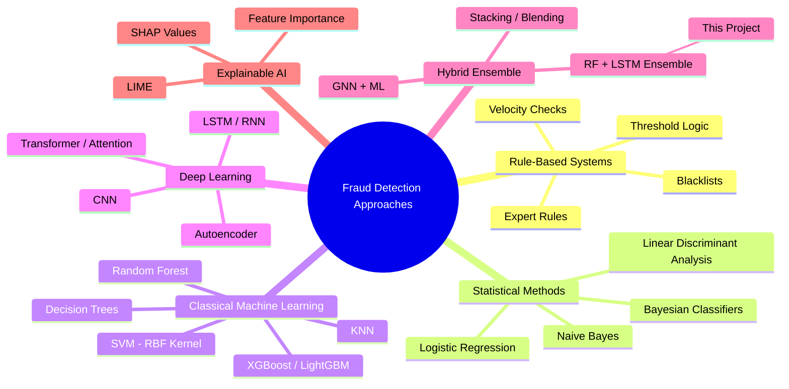
```mermaid
mindmap
  root((Fraud Detection Approaches))
    Rule-Based Systems
      Expert Rules
      Threshold Logic
      Velocity Checks
      Blacklists
    Statistical Methods
      Logistic Regression
      Linear Discriminant Analysis
      Bayesian Classifiers
      Naive Bayes
    Classical Machine Learning
      Decision Trees
      Random Forest
      SVM - RBF Kernel
      KNN
      XGBoost / LightGBM
    Deep Learning
      LSTM / RNN
      CNN
      Autoencoder
      Transformer / Attention
    Hybrid Ensemble
      RF + LSTM Ensemble
        This Project
      GNN + ML
      Stacking / Blending
    Explainable AI
      SHAP Values
      LIME
      Feature Importance
```

---

## Figure 2.2 — SMOTE Synthetic Sample Generation Process
> *Used in Chapter 2, Page 17*

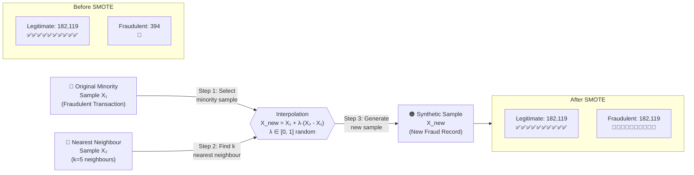
```mermaid
flowchart LR
    A["🔴 Original Minority\nSample X₁\n(Fraudulent Transaction)"]
    B["🔴 Nearest Neighbour\nSample X₂\n(k=5 neighbours)"]
    C{{"Interpolation\nX_new = X₁ + λ·(X₂ - X₁)\nλ ∈ [0, 1] random"}}
    D["🟠 Synthetic Sample\nX_new\n(New Fraud Record)"]

    A -->|"Step 1: Select\nminority sample"| C
    B -->|"Step 2: Find k\nnearest neighbour"| C
    C -->|"Step 3: Generate\nnew sample"| D

    subgraph BEFORE["Before SMOTE"]
        direction TB
        E["Legitimate: 182,119\n✅✅✅✅✅✅✅✅✅✅"]
        F["Fraudulent:     394\n🔴"]
    end

    subgraph AFTER["After SMOTE"]
        direction TB
        G["Legitimate: 182,119\n✅✅✅✅✅✅✅✅✅✅"]
        H["Fraudulent: 182,119\n🔴🔴🔴🔴🔴🔴🔴🔴🔴🔴"]
    end

    D --> AFTER
```

---

## Figure 4.1 — High-Level System Architecture Diagram
> *Used in Chapter 4, Page 32*

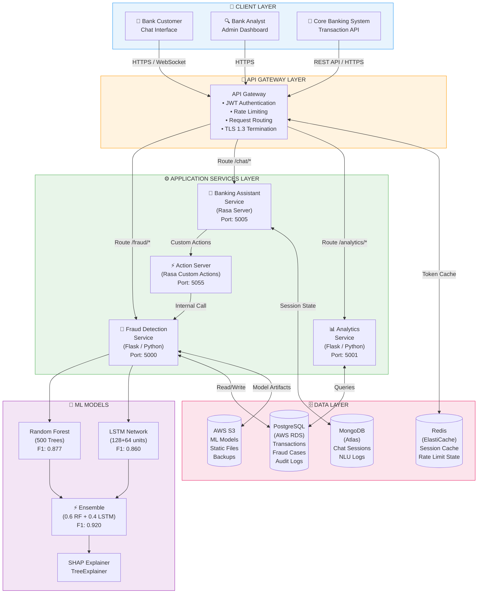
```mermaid
graph TB
    subgraph CLIENTS["👥 CLIENT LAYER"]
        C1["🧑 Bank Customer\nChat Interface"]
        C2["🔍 Bank Analyst\nAdmin Dashboard"]
        C3["🏦 Core Banking System\nTransaction API"]
    end

    subgraph GATEWAY["🔐 API GATEWAY LAYER"]
        GW["API Gateway\n• JWT Authentication\n• Rate Limiting\n• Request Routing\n• TLS 1.3 Termination"]
    end

    subgraph SERVICES["⚙️ APPLICATION SERVICES LAYER"]
        direction LR
        FS["🤖 Fraud Detection\nService\n(Flask / Python)\nPort: 5000"]
        BS["💬 Banking Assistant\nService\n(Rasa Server)\nPort: 5005"]
        AS["📊 Analytics\nService\n(Flask / Python)\nPort: 5001"]
        ACT["⚡ Action Server\n(Rasa Custom Actions)\nPort: 5055"]
    end

    subgraph DATA["🗄️ DATA LAYER"]
        PG[("PostgreSQL\n(AWS RDS)\nTransactions\nFraud Cases\nAudit Logs")]
        MG[("MongoDB\n(Atlas)\nChat Sessions\nNLU Logs")]
        RD[("Redis\n(ElastiCache)\nSession Cache\nRate Limit State")]
        S3[("AWS S3\nML Models\nStatic Files\nBackups")]
    end

    subgraph ML["🧠 ML MODELS"]
        RF["Random Forest\n(500 Trees)\nF1: 0.877"]
        LSTM["LSTM Network\n(128+64 units)\nF1: 0.860"]
        EN["⚡ Ensemble\n(0.6 RF + 0.4 LSTM)\nF1: 0.920"]
        SH["SHAP Explainer\nTreeExplainer"]
    end

    C1 -->|"HTTPS / WebSocket"| GW
    C2 -->|"HTTPS"| GW
    C3 -->|"REST API / HTTPS"| GW

    GW -->|"Route /fraud/*"| FS
    GW -->|"Route /chat/*"| BS
    GW -->|"Route /analytics/*"| AS

    BS -->|"Custom Actions"| ACT
    ACT -->|"Internal Call"| FS

    FS --> RF
    FS --> LSTM
    RF --> EN
    LSTM --> EN
    EN --> SH

    FS <-->|"Read/Write"| PG
    FS <-->|"Model Artifacts"| S3
    BS <-->|"Session State"| MG
    AS <-->|"Queries"| PG
    GW <-->|"Token Cache"| RD

    style CLIENTS fill:#E8F4FD,stroke:#2196F3
    style GATEWAY fill:#FFF3E0,stroke:#FF9800
    style SERVICES fill:#E8F5E9,stroke:#4CAF50
    style DATA fill:#FCE4EC,stroke:#E91E63
    style ML fill:#F3E5F5,stroke:#9C27B0
```

---

## Figure 4.2 — Fraud Detection Module Data Flow
> *Used in Chapter 4, Page 34*

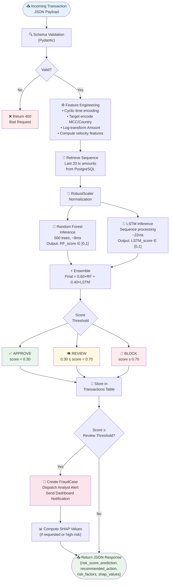
```mermaid
flowchart TD
    A(["📥 Incoming Transaction\nJSON Payload"])
    B["🔍 Schema Validation\n(Pydantic)"]
    C{Valid?}
    D["❌ Return 400\nBad Request"]
    E["⚙️ Feature Engineering\n• Cyclic time encoding\n• Target encode MCC/Country\n• Log-transform Amount\n• Compute velocity features"]
    F["📜 Retrieve Sequence\nLast 20 tx amounts\nfrom PostgreSQL"]
    G["📐 RobustScaler\nNormalization"]
    H["🌲 Random Forest\nInference\n500 trees, ~8ms\nOutput: RF_score ∈ [0,1]"]
    I["🧠 LSTM Inference\nSequence processing\n~22ms\nOutput: LSTM_score ∈ [0,1]"]
    J["⚡ Ensemble\nFinal = 0.60×RF + 0.40×LSTM"]
    K{"Score\nThreshold"}
    L["✅ APPROVE\nscore < 0.30"]
    M["👁️ REVIEW\n0.30 ≤ score < 0.70"]
    N["🚫 BLOCK\nscore ≥ 0.70"]
    O["💾 Store in\nTransactions Table"]
    P{"Score ≥\nReview Threshold?"}
    Q["🚨 Create FraudCase\nDispatch Analyst Alert\nSend Dashboard Notification"]
    R["📊 Compute SHAP Values\n(if requested or high-risk)"]
    S(["📤 Return JSON Response\n{risk_score, prediction,\nrecommended_action,\nrisk_factors, shap_values}"])

    A --> B --> C
    C -- No --> D
    C -- Yes --> E
    E --> F --> G
    G --> H
    G --> I
    H --> J
    I --> J
    J --> K
    K --> L
    K --> M
    K --> N
    L --> O
    M --> O
    N --> O
    O --> P
    P -- Yes --> Q --> R --> S
    P -- No --> S

    style A fill:#E3F2FD
    style S fill:#E8F5E9
    style D fill:#FFEBEE
    style N fill:#FFEBEE
    style M fill:#FFF8E1
    style L fill:#E8F5E9
    style Q fill:#FCE4EC
```

---

## Figure 4.3 — LSTM Cell Internal Gate Architecture
> *Used in Chapter 4, Page 35*

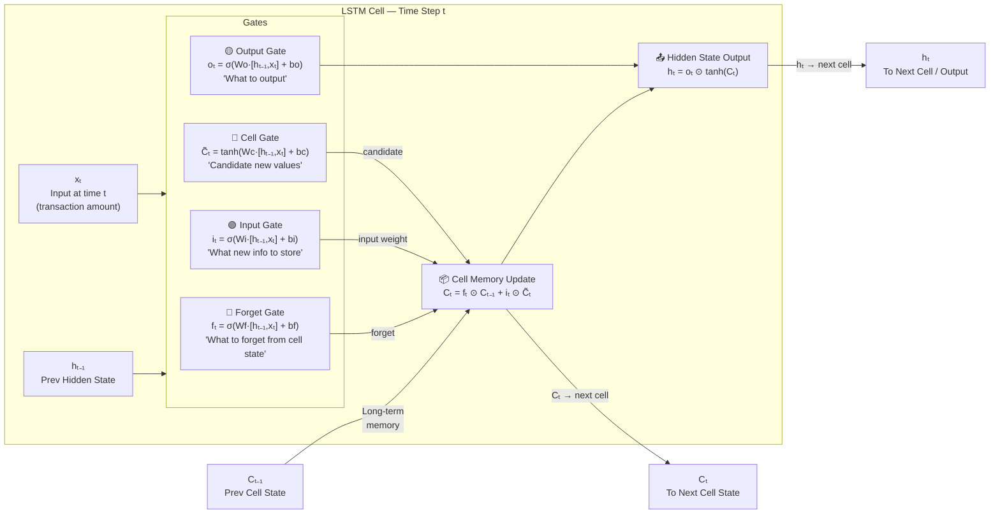
```mermaid
flowchart LR
    subgraph CELL["LSTM Cell — Time Step t"]
        direction TB

        H_PREV["hₜ₋₁\nPrev Hidden State"]
        X_T["xₜ\nInput at time t\n(transaction amount)"]

        subgraph GATES["Gates"]
            FG["🔴 Forget Gate\nfₜ = σ(Wf·[hₜ₋₁,xₜ] + bf)\n'What to forget from cell state'"]
            IG["🟢 Input Gate\niₜ = σ(Wi·[hₜ₋₁,xₜ] + bi)\n'What new info to store'"]
            CG["🔵 Cell Gate\nC̃ₜ = tanh(Wc·[hₜ₋₁,xₜ] + bc)\n'Candidate new values'"]
            OG["🟡 Output Gate\noₜ = σ(Wo·[hₜ₋₁,xₜ] + bo)\n'What to output'"]
        end

        CM["📦 Cell Memory Update\nCₜ = fₜ ⊙ Cₜ₋₁ + iₜ ⊙ C̃ₜ"]
        HO["📤 Hidden State Output\nhₜ = oₜ ⊙ tanh(Cₜ)"]
    end

    C_PREV["Cₜ₋₁\nPrev Cell State"]

    H_PREV --> GATES
    X_T --> GATES
    C_PREV -->|"Long-term\nmemory"| CM
    FG -->|"forget"| CM
    IG -->|"input weight"| CM
    CG -->|"candidate"| CM
    CM --> HO
    OG --> HO

    HO -->|"hₜ → next cell"| H_NEXT["hₜ\nTo Next Cell / Output"]
    CM -->|"Cₜ → next cell"| C_NEXT["Cₜ\nTo Next Cell State"]
```

---

## Figure 4.4 — Chatbot Conversation Flow Diagram
> *Used in Chapter 4, Page 37*

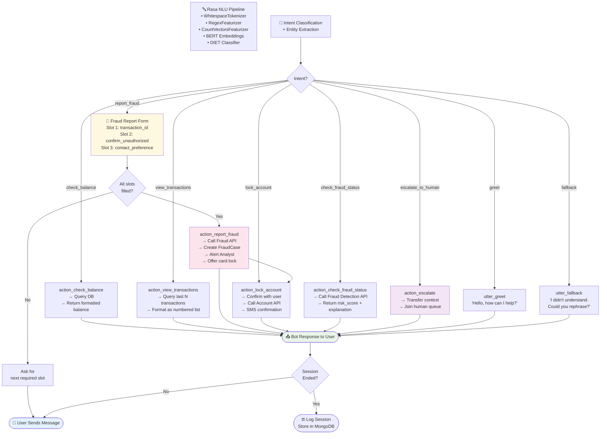
```mermaid
flowchart TD
    A(["👤 User Sends Message"])
    B["🔤 Rasa NLU Pipeline\n• WhitespaceTokenizer\n• RegexFeaturizer\n• CountVectorsFeaturizer\n• BERT Embeddings\n• DIET Classifier"]
    C["🎯 Intent Classification\n+ Entity Extraction"]

    C --> D{Intent?}

    D -->|"greet"| E["utter_greet\n'Hello, how can I help?'"]
    D -->|"check_balance"| F["action_check_balance\n→ Query DB\n→ Return formatted balance"]
    D -->|"view_transactions"| G["action_view_transactions\n→ Query last N transactions\n→ Format as numbered list"]
    D -->|"report_fraud"| H["🚨 Fraud Report Form\nSlot 1: transaction_id\nSlot 2: confirm_unauthorized\nSlot 3: contact_preference"]
    D -->|"lock_account"| I["action_lock_account\n→ Confirm with user\n→ Call Account API\n→ SMS confirmation"]
    D -->|"check_fraud_status"| J["action_check_fraud_status\n→ Call Fraud Detection API\n→ Return risk_score + explanation"]
    D -->|"escalate_to_human"| K["action_escalate\n→ Transfer context\n→ Join human queue"]
    D -->|"fallback"| L["utter_fallback\n'I didn't understand.\nCould you rephrase?'"]

    H --> H1{"All slots\nfilled?"}
    H1 -- No --> H2["Ask for\nnext required slot"]
    H2 --> A
    H1 -- Yes --> H3["action_report_fraud\n→ Call Fraud API\n→ Create FraudCase\n→ Alert Analyst\n→ Offer card lock"]

    H3 --> I

    F --> Z(["📤 Bot Response to User"])
    G --> Z
    H3 --> Z
    I --> Z
    J --> Z
    K --> Z
    E --> Z
    L --> Z

    Z --> END{Session\nEnded?}
    END -- No --> A
    END -- Yes --> CLOSE(["🔚 Log Session\nStore in MongoDB"])

    style A fill:#E3F2FD
    style H fill:#FFF8E1
    style H3 fill:#FCE4EC
    style K fill:#F3E5F5
    style Z fill:#E8F5E9
```

---

## Figure 4.5 — Entity-Relationship (ER) Diagram
> *Used in Chapter 4, Page 40*

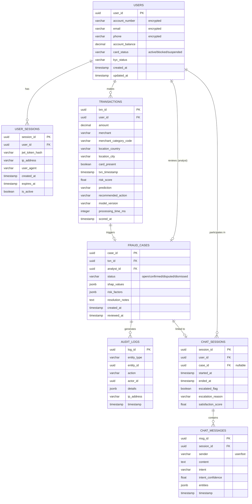
```mermaid
erDiagram
    USERS {
        uuid user_id PK
        varchar account_number "encrypted"
        varchar email "encrypted"
        varchar phone "encrypted"
        decimal account_balance
        varchar card_status "active/blocked/suspended"
        varchar kyc_status
        timestamp created_at
        timestamp updated_at
    }

    USER_SESSIONS {
        uuid session_id PK
        uuid user_id FK
        varchar jwt_token_hash
        varchar ip_address
        varchar user_agent
        timestamp created_at
        timestamp expires_at
        boolean is_active
    }

    TRANSACTIONS {
        uuid txn_id PK
        uuid user_id FK
        decimal amount
        varchar merchant
        varchar merchant_category_code
        varchar location_country
        varchar location_city
        boolean card_present
        timestamp txn_timestamp
        float risk_score
        varchar prediction
        varchar recommended_action
        varchar model_version
        integer processing_time_ms
        timestamp scored_at
    }

    FRAUD_CASES {
        uuid case_id PK
        uuid txn_id FK
        uuid analyst_id FK
        varchar status "open/confirmed/disputed/dismissed"
        jsonb shap_values
        jsonb risk_factors
        text resolution_notes
        timestamp created_at
        timestamp reviewed_at
    }

    AUDIT_LOGS {
        uuid log_id PK
        varchar entity_type
        uuid entity_id
        varchar action
        uuid actor_id
        jsonb details
        varchar ip_address
        timestamp timestamp
    }

    CHAT_SESSIONS {
        uuid session_id PK
        uuid user_id FK
        uuid case_id FK "nullable"
        timestamp started_at
        timestamp ended_at
        boolean escalated_flag
        varchar escalation_reason
        float satisfaction_score
    }

    CHAT_MESSAGES {
        uuid msg_id PK
        uuid session_id FK
        varchar sender "user/bot"
        text content
        varchar intent
        float intent_confidence
        jsonb entities
        timestamp timestamp
    }

    USERS ||--o{ USER_SESSIONS : "has"
    USERS ||--o{ TRANSACTIONS : "makes"
    TRANSACTIONS ||--o| FRAUD_CASES : "triggers"
    USERS ||--o| FRAUD_CASES : "reviews (analyst)"
    FRAUD_CASES ||--o{ AUDIT_LOGS : "generates"
    USERS ||--o{ CHAT_SESSIONS : "participates in"
    FRAUD_CASES ||--o| CHAT_SESSIONS : "linked to"
    CHAT_SESSIONS ||--o{ CHAT_MESSAGES : "contains"
```

---

## Figure 4.6 — Level-0 Context DFD (Context Diagram)
> *Used in Chapter 4, Page 41*

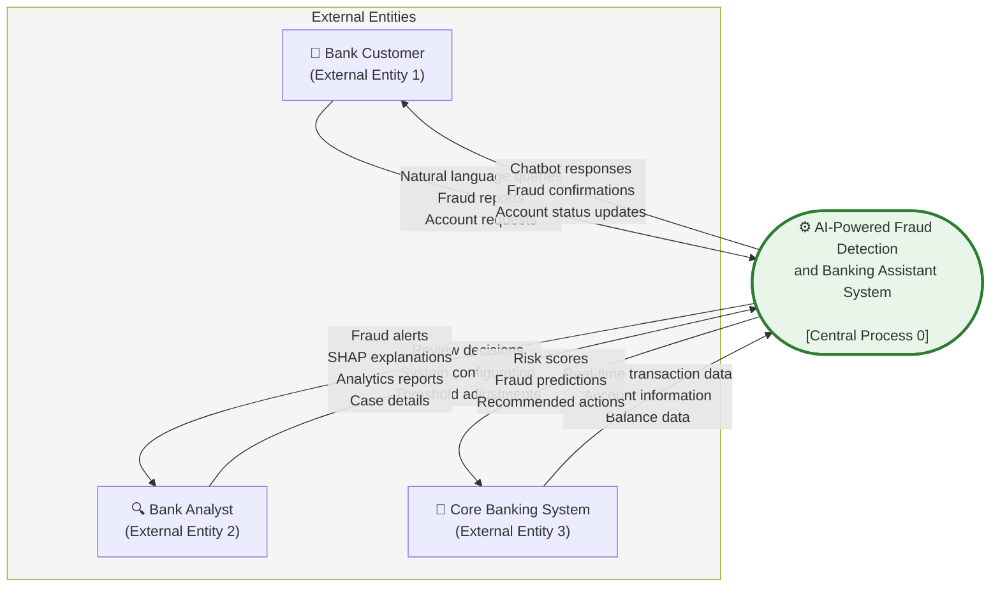
```mermaid
flowchart TB
    subgraph EXT["External Entities"]
        BC["👤 Bank Customer\n(External Entity 1)"]
        BA["🔍 Bank Analyst\n(External Entity 2)"]
        CBS["🏦 Core Banking System\n(External Entity 3)"]
    end

    SYSTEM(["⚙️ AI-Powered Fraud Detection\nand Banking Assistant System\n\n[Central Process 0]"])

    BC -->|"Natural language queries\nFraud reports\nAccount requests"| SYSTEM
    SYSTEM -->|"Chatbot responses\nFraud confirmations\nAccount status updates"| BC

    BA -->|"Review decisions\nSystem configuration\nThreshold adjustments"| SYSTEM
    SYSTEM -->|"Fraud alerts\nSHAP explanations\nAnalytics reports\nCase details"| BA

    CBS -->|"Real-time transaction data\nAccount information\nBalance data"| SYSTEM
    SYSTEM -->|"Risk scores\nFraud predictions\nRecommended actions"| CBS

    style SYSTEM fill:#E8F5E9,stroke:#2E7D32,stroke-width:3px
    style EXT fill:#F5F5F5
```

---

## Figure 4.7 — Level-1 Detailed DFD
> *Used in Chapter 4, Page 42*

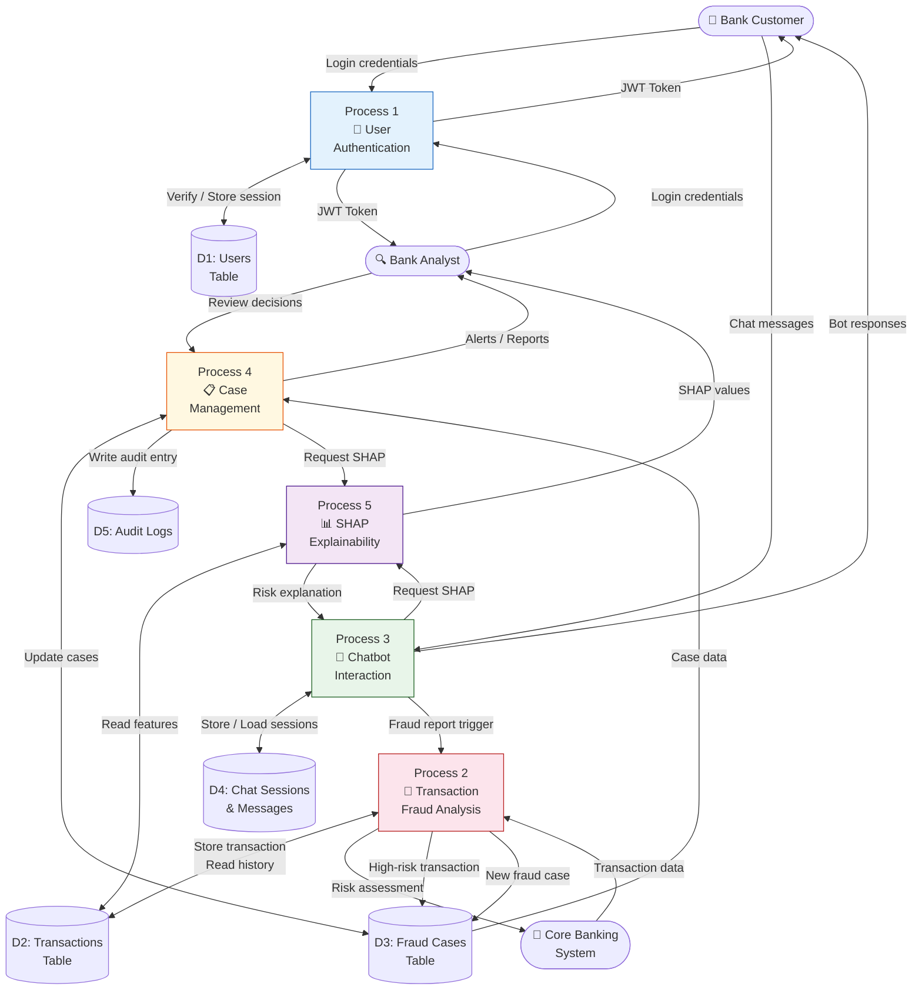
```mermaid
flowchart TB
    BC(["👤 Bank Customer"])
    BA(["🔍 Bank Analyst"])
    CBS(["🏦 Core Banking\nSystem"])

    P1["Process 1\n🔐 User\nAuthentication"]
    P2["Process 2\n🤖 Transaction\nFraud Analysis"]
    P3["Process 3\n💬 Chatbot\nInteraction"]
    P4["Process 4\n📋 Case\nManagement"]
    P5["Process 5\n📊 SHAP\nExplainability"]

    DS1[("D1: Users\nTable")]
    DS2[("D2: Transactions\nTable")]
    DS3[("D3: Fraud Cases\nTable")]
    DS4[("D4: Chat Sessions\n& Messages")]
    DS5[("D5: Audit Logs")]

    BC -->|"Login credentials"| P1
    BA -->|"Login credentials"| P1
    P1 <-->|"Verify / Store session"| DS1
    P1 -->|"JWT Token"| BC
    P1 -->|"JWT Token"| BA

    CBS -->|"Transaction data"| P2
    P2 <-->|"Store transaction\nRead history"| DS2
    P2 -->|"Risk assessment"| CBS
    P2 -->|"High-risk transaction"| DS3

    BC -->|"Chat messages"| P3
    P3 <-->|"Store / Load sessions"| DS4
    P3 -->|"Bot responses"| BC
    P3 -->|"Fraud report trigger"| P2
    P3 -->|"Request SHAP"| P5

    BA -->|"Review decisions"| P4
    P4 <-->|"Update cases"| DS3
    P4 -->|"Alerts / Reports"| BA
    P4 -->|"Write audit entry"| DS5
    P4 -->|"Request SHAP"| P5

    P2 -->|"New fraud case"| DS3
    DS3 -->|"Case data"| P4

    P5 <-->|"Read features"| DS2
    P5 -->|"SHAP values"| BA
    P5 -->|"Risk explanation"| P3

    style P1 fill:#E3F2FD,stroke:#1565C0
    style P2 fill:#FCE4EC,stroke:#B71C1C
    style P3 fill:#E8F5E9,stroke:#1B5E20
    style P4 fill:#FFF8E1,stroke:#E65100
    style P5 fill:#F3E5F5,stroke:#4A148C
```

---

## Figure 5.1 — Data Preprocessing Pipeline Flowchart
> *Used in Chapter 5, Page 49*


```mermaid
flowchart LR
    RAW(["📥 Raw Dataset\n284,807 records\n30 features"])

    subgraph SPLIT["Step 1: Data Split"]
        TR["Training Set\n80% = 227,846\nStratified Split"]
        TE["Test Set\n20% = 56,961\nNEVER touched during training"]
    end

    subgraph INSPECT["Step 2: Inspection"]
        MV["Missing Values\n→ Median impute (numerical)\n→ Mode impute (categorical)"]
        OUT["Outlier Analysis\nBox plots, IQR check\n→ Log-transform Amount"]
        DIST["Distribution Check\nClass ratio: 0.172% fraud\n→ Confirm class imbalance"]
    end

    subgraph SCALE["Step 3: Feature Scaling"]
        RS["RobustScaler\nAmount & Time features\nMedian=0, IQR-scaled\nRobust to outliers"]
        CE["Cyclic Encoding\nhour_sin = sin(2π×h/24)\nhour_cos = cos(2π×h/24)\nday_sin / day_cos"]
        TE2["Target Encoding\nMCC, Country Code\nMapped to fraud rate\nper category"]
    end

    subgraph BALANCE["Step 4: SMOTE (Training Only!)"]
        SM["SMOTE\nk_neighbors=5\nGenerate synthetic\nfraud samples\nFraud: 394→182,119"]
    end

    subgraph READY["Step 5: Model-Ready Output"]
        RF_IN["Random Forest Input\nShape: (364,238, 30)\nBalanced 50:50"]
        LSTM_IN["LSTM Input\nShape: (364,238, 20, 1)\nNormalized sequences"]
    end

    RAW --> SPLIT
    TR --> INSPECT
    INSPECT --> SCALE
    SCALE --> BALANCE
    BALANCE --> RF_IN
    BALANCE --> LSTM_IN
    TE -->|"Scaler applied only\n(no SMOTE!)"| TEST_READY["Test Set Ready\n(56,961 × 30)\nUnbalanced — real distribution"]

    style RAW fill:#E3F2FD
    style BALANCE fill:#FCE4EC
    style READY fill:#E8F5E9
    style TE fill:#FFF8E1
```

---

## Figure 5.2 — Class Distribution Before and After SMOTE
> *Used in Chapter 5, Page 51*

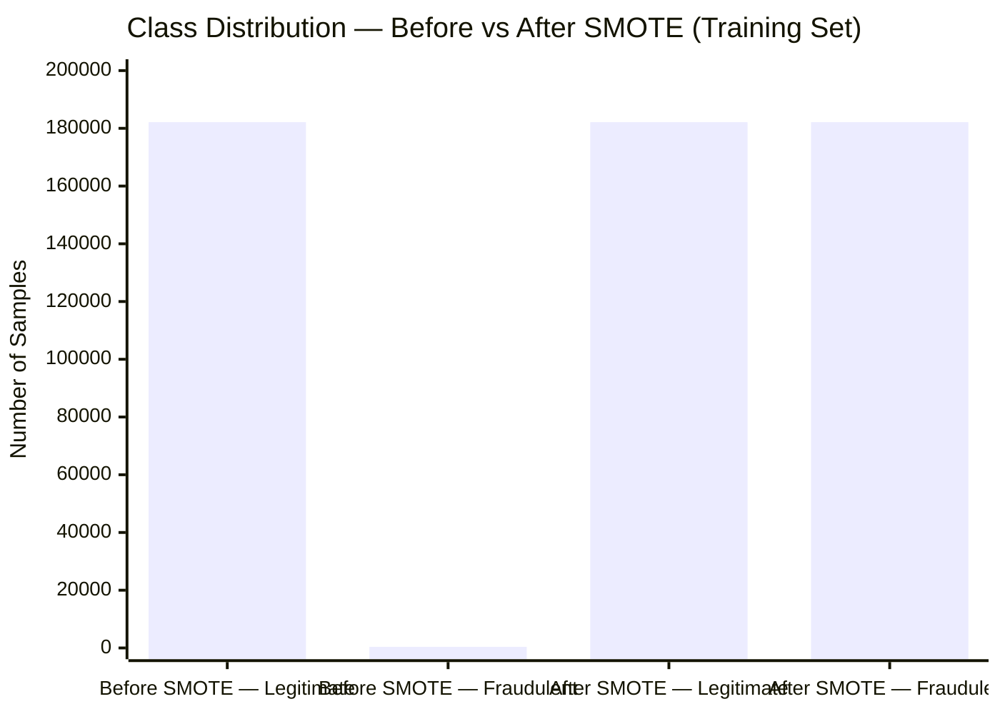
```mermaid
xychart-beta
    title "Class Distribution — Before vs After SMOTE (Training Set)"
    x-axis ["Before SMOTE — Legitimate", "Before SMOTE — Fraudulent", "After SMOTE — Legitimate", "After SMOTE — Fraudulent"]
    y-axis "Number of Samples" 0 --> 200000
    bar [182119, 394, 182119, 182119]
```

---

## Figure 5.3 — Random Forest Ensemble of Decision Trees
> *Used in Chapter 5, Page 52*

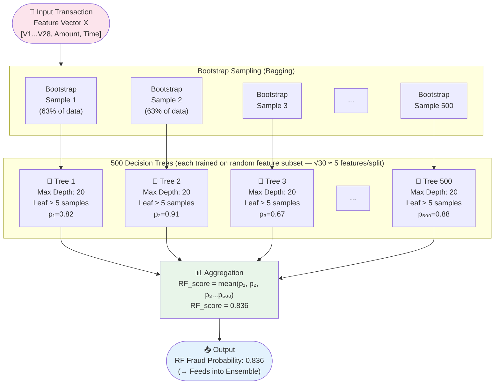
```mermaid
flowchart TB
    TX(["🔴 Input Transaction\nFeature Vector X\n[V1...V28, Amount, Time]"])

    subgraph BOOTSTRAP["Bootstrap Sampling (Bagging)"]
        direction LR
        B1["Bootstrap\nSample 1\n(63% of data)"]
        B2["Bootstrap\nSample 2\n(63% of data)"]
        B3["Bootstrap\nSample 3"]
        BDOT["  ...  "]
        B500["Bootstrap\nSample 500"]
    end

    subgraph TREES["500 Decision Trees (each trained on random feature subset — √30 ≈ 5 features/split)"]
        direction LR
        T1["🌲 Tree 1\nMax Depth: 20\nLeaf ≥ 5 samples\np₁=0.82"]
        T2["🌲 Tree 2\nMax Depth: 20\nLeaf ≥ 5 samples\np₂=0.91"]
        T3["🌲 Tree 3\nMax Depth: 20\nLeaf ≥ 5 samples\np₃=0.67"]
        TDOT["  ...  "]
        T500["🌲 Tree 500\nMax Depth: 20\nLeaf ≥ 5 samples\np₅₀₀=0.88"]
    end

    AGG["📊 Aggregation\nRF_score = mean(p₁, p₂, p₃...p₅₀₀)\nRF_score = 0.836"]

    OUT(["📤 Output\nRF Fraud Probability: 0.836\n(→ Feeds into Ensemble)"])

    TX --> BOOTSTRAP
    B1 --> T1
    B2 --> T2
    B3 --> T3
    B500 --> T500
    T1 --> AGG
    T2 --> AGG
    T3 --> AGG
    T500 --> AGG
    AGG --> OUT

    style TX fill:#FCE4EC
    style AGG fill:#E8F5E9
    style OUT fill:#E3F2FD
```

---

## Figure 5.5 — Ensemble Decision Combination Strategy
> *Used in Chapter 5, Page 56*

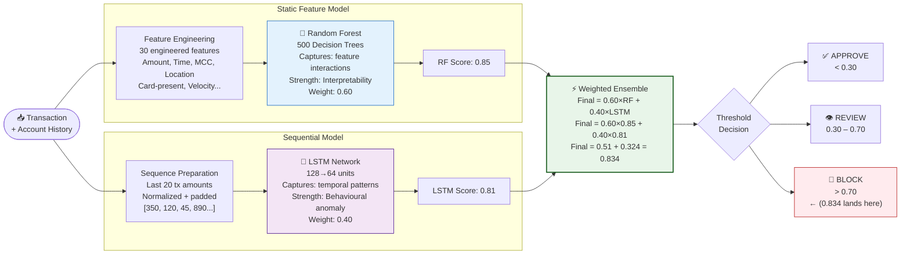
```mermaid
flowchart LR
    TX(["📥 Transaction\n+ Account History"])

    subgraph MODEL1["Static Feature Model"]
        RF_F["Feature Engineering\n30 engineered features\nAmount, Time, MCC, Location\nCard-present, Velocity..."]
        RF_M["🌲 Random Forest\n500 Decision Trees\nCaptures: feature interactions\nStrength: Interpretability\nWeight: 0.60"]
        RF_S["RF Score: 0.85"]
    end

    subgraph MODEL2["Sequential Model"]
        LSTM_F["Sequence Preparation\nLast 20 tx amounts\nNormalized + padded\n[350, 120, 45, 890...]"]
        LSTM_M["🧠 LSTM Network\n128→64 units\nCaptures: temporal patterns\nStrength: Behavioural anomaly\nWeight: 0.40"]
        LSTM_S["LSTM Score: 0.81"]
    end

    ENS["⚡ Weighted Ensemble\nFinal = 0.60×RF + 0.40×LSTM\nFinal = 0.60×0.85 + 0.40×0.81\nFinal = 0.51 + 0.324 = 0.834"]

    THR{"Threshold\nDecision"}
    APP["✅ APPROVE\n< 0.30"]
    REV["👁️ REVIEW\n0.30 – 0.70"]
    BLK["🚫 BLOCK\n> 0.70\n← (0.834 lands here)"]

    TX --> RF_F --> RF_M --> RF_S
    TX --> LSTM_F --> LSTM_M --> LSTM_S
    RF_S --> ENS
    LSTM_S --> ENS
    ENS --> THR
    THR --> APP
    THR --> REV
    THR --> BLK

    style RF_M fill:#E3F2FD,stroke:#1565C0
    style LSTM_M fill:#F3E5F5,stroke:#4A148C
    style ENS fill:#E8F5E9,stroke:#1B5E20,stroke-width:2px
    style BLK fill:#FFEBEE,stroke:#B71C1C
```

---

## Figure 5.6 — SHAP Summary Plot (Feature Contributions)
> *Used in Chapter 5, Page 57*

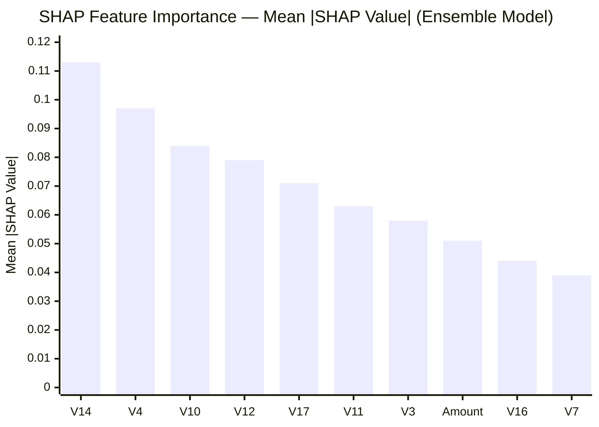
```mermaid
xychart-beta
    title "SHAP Feature Importance — Mean |SHAP Value| (Ensemble Model)"
    x-axis ["V14", "V4", "V10", "V12", "V17", "V11", "V3", "Amount", "V16", "V7"]
    y-axis "Mean |SHAP Value|" 0 --> 0.12
    bar [0.113, 0.097, 0.084, 0.079, 0.071, 0.063, 0.058, 0.051, 0.044, 0.039]
```

---

## Figure 5.7 — Rasa NLU DIET Architecture
> *Used in Chapter 5, Page 60*

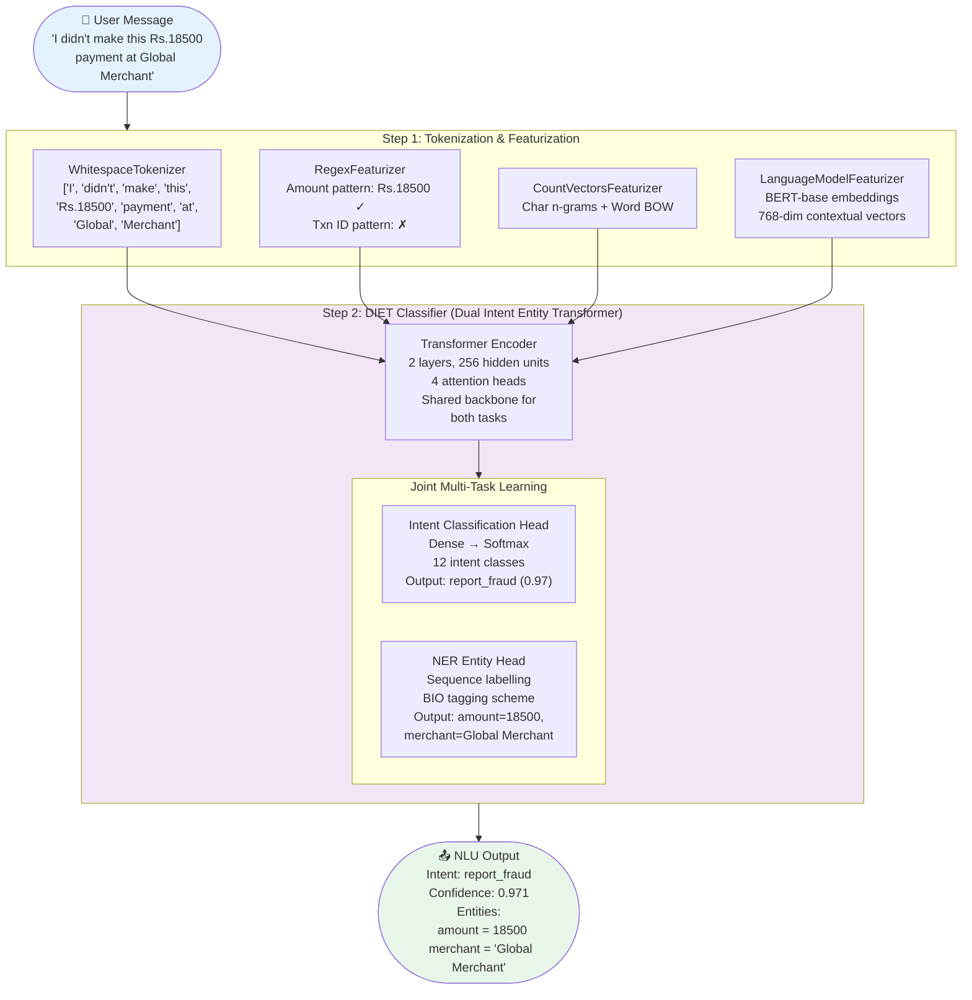
```mermaid
flowchart TB
    USR(["👤 User Message\n'I didn't make this Rs.18500\npayment at Global Merchant'"])

    subgraph TOKENIZE["Step 1: Tokenization & Featurization"]
        T1["WhitespaceTokenizer\n['I', 'didn't', 'make', 'this',\n'Rs.18500', 'payment', 'at',\n'Global', 'Merchant']"]
        T2["RegexFeaturizer\nAmount pattern: Rs.18500 ✓\nTxn ID pattern: ✗"]
        T3["CountVectorsFeaturizer\nChar n-grams + Word BOW"]
        T4["LanguageModelFeaturizer\nBERT-base embeddings\n768-dim contextual vectors"]
    end

    subgraph DIET["Step 2: DIET Classifier (Dual Intent Entity Transformer)"]
        direction LR
        TRF["Transformer Encoder\n2 layers, 256 hidden units\n4 attention heads\nShared backbone for\nboth tasks"]

        subgraph TASKS["Joint Multi-Task Learning"]
            INT["Intent Classification Head\nDense → Softmax\n12 intent classes\nOutput: report_fraud (0.97)"]
            ENT["NER Entity Head\nSequence labelling\nBIO tagging scheme\nOutput: amount=18500,\nmerchant=Global Merchant"]
        end

        TRF --> TASKS
    end

    OUT(["📤 NLU Output\nIntent: report_fraud\nConfidence: 0.971\nEntities:\n  amount = 18500\n  merchant = 'Global Merchant'"])

    USR --> TOKENIZE
    T1 --> TRF
    T2 --> TRF
    T3 --> TRF
    T4 --> TRF
    DIET --> OUT

    style USR fill:#E3F2FD
    style DIET fill:#F3E5F5
    style OUT fill:#E8F5E9
```

---

## Figure 5.8 — Rasa Dialogue Management — TED Policy Flow
> *Used in Chapter 5, Page 61*

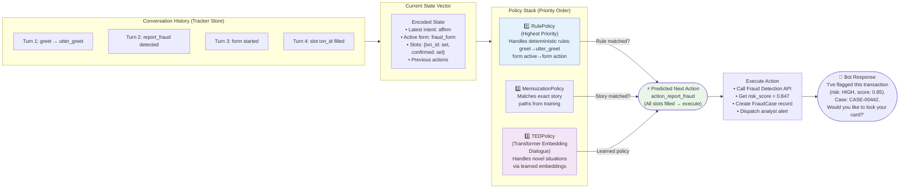
```mermaid
flowchart LR
    subgraph HISTORY["Conversation History (Tracker Store)"]
        direction TB
        H1["Turn 1: greet → utter_greet"]
        H2["Turn 2: report_fraud detected"]
        H3["Turn 3: form started"]
        H4["Turn 4: slot txn_id filled"]
    end

    subgraph STATE["Current State Vector"]
        SV["Encoded State\n• Latest intent: affirm\n• Active form: fraud_form\n• Slots: {txn_id: set,\n  confirmed: set}\n• Previous actions"]
    end

    subgraph POLICIES["Policy Stack (Priority Order)"]
        RP["1️⃣ RulePolicy\n(Highest Priority)\nHandles deterministic rules:\ngreet→utter_greet\nform active→form action"]
        MP["2️⃣ MemoizationPolicy\nMatches exact story\npaths from training"]
        TP["3️⃣ TEDPolicy\n(Transformer Embedding\nDialogue)\nHandles novel situations\nvia learned embeddings"]
    end

    ACTION(["⚡ Predicted Next Action\naction_report_fraud\n(All slots filled → execute)"])

    EXEC["Execute Action\n• Call Fraud Detection API\n• Get risk_score = 0.847\n• Create FraudCase record\n• Dispatch analyst alert"]

    RESP(["💬 Bot Response\n'I've flagged this transaction\n(risk: HIGH, score: 0.85).\nCase: CASE-00442.\nWould you like to lock your card?'"])

    HISTORY --> STATE
    STATE --> POLICIES
    RP -->|"Rule matched?"| ACTION
    MP -->|"Story matched?"| ACTION
    TP -->|"Learned policy"| ACTION
    ACTION --> EXEC --> RESP

    style ACTION fill:#E8F5E9
    style TP fill:#F3E5F5
    style RP fill:#E3F2FD
```

---

## Figure 5.9 — Flask API Server Architecture
> *Used in Chapter 5, Page 63*

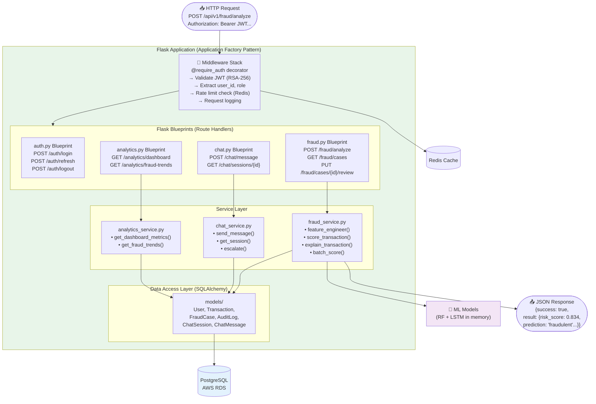
```mermaid
flowchart TB
    REQ(["📥 HTTP Request\nPOST /api/v1/fraud/analyze\nAuthorization: Bearer JWT..."])

    subgraph FLASK["Flask Application (Application Factory Pattern)"]
        direction TB

        MW["🔐 Middleware Stack\n@require_auth decorator\n→ Validate JWT (RSA-256)\n→ Extract user_id, role\n→ Rate limit check (Redis)\n→ Request logging"]

        subgraph BP["Flask Blueprints (Route Handlers)"]
            direction LR
            AUTH_BP["auth.py Blueprint\nPOST /auth/login\nPOST /auth/refresh\nPOST /auth/logout"]
            FRAUD_BP["fraud.py Blueprint\nPOST /fraud/analyze\nGET /fraud/cases\nPUT /fraud/cases/{id}/review"]
            CHAT_BP["chat.py Blueprint\nPOST /chat/message\nGET /chat/sessions/{id}"]
            ANAL_BP["analytics.py Blueprint\nGET /analytics/dashboard\nGET /analytics/fraud-trends"]
        end

        subgraph SVC["Service Layer"]
            FS["fraud_service.py\n• feature_engineer()\n• score_transaction()\n• explain_transaction()\n• batch_score()"]
            CS["chat_service.py\n• send_message()\n• get_session()\n• escalate()"]
            AS["analytics_service.py\n• get_dashboard_metrics()\n• get_fraud_trends()"]
        end

        subgraph ORM["Data Access Layer (SQLAlchemy)"]
            MODELS["models/\nUser, Transaction,\nFraudCase, AuditLog,\nChatSession, ChatMessage"]
        end
    end

    DB[("PostgreSQL\nAWS RDS")]
    RD[("Redis Cache")]
    ML["🤖 ML Models\n(RF + LSTM in memory)"]

    REQ --> MW
    MW --> BP
    FRAUD_BP --> FS
    CHAT_BP --> CS
    ANAL_BP --> AS
    FS --> ML
    FS --> MODELS
    CS --> MODELS
    AS --> MODELS
    MODELS --> DB
    MW --> RD

    RESP(["📤 JSON Response\n{success: true,\nresult: {risk_score: 0.834,\nprediction: 'fraudulent'...}}"])

    FS --> RESP

    style FLASK fill:#E8F5E9
    style ML fill:#F3E5F5
    style DB fill:#E3F2FD
```

---

## Figure 6.1 — ROC Curves Comparison (All Models)
> *Used in Chapter 6, Page 71*

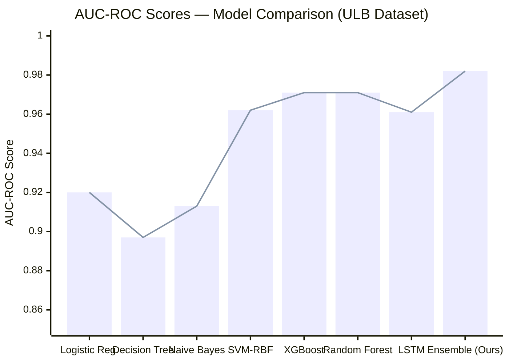
```mermaid
xychart-beta
    title "AUC-ROC Scores — Model Comparison (ULB Dataset)"
    x-axis ["Logistic Reg.", "Decision Tree", "Naive Bayes", "SVM-RBF", "XGBoost", "Random Forest", "LSTM", "Ensemble (Ours)"]
    y-axis "AUC-ROC Score" 0.85 --> 1.00
    bar [0.920, 0.897, 0.913, 0.962, 0.971, 0.971, 0.961, 0.982]
    line [0.920, 0.897, 0.913, 0.962, 0.971, 0.971, 0.961, 0.982]
```

---

## Figure 6.2 — F1-Score and Precision-Recall Comparison
> *Used in Chapter 6, Page 72*

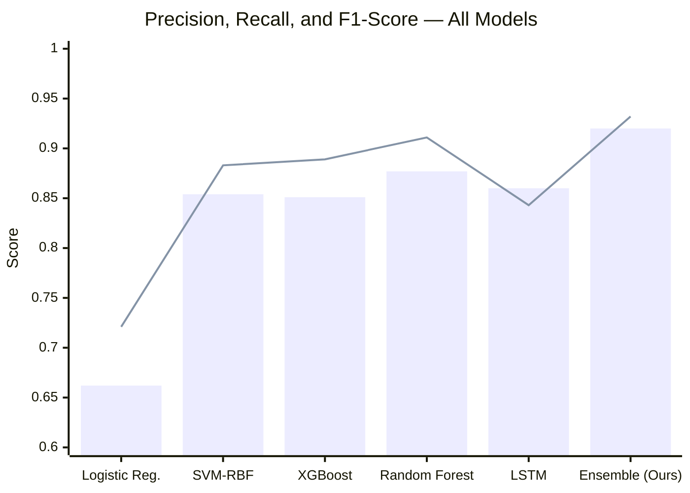
```mermaid
xychart-beta
    title "Precision, Recall, and F1-Score — All Models"
    x-axis ["Logistic Reg.", "SVM-RBF", "XGBoost", "Random Forest", "LSTM", "Ensemble (Ours)"]
    y-axis "Score" 0.60 --> 1.00
    bar [0.662, 0.854, 0.851, 0.877, 0.860, 0.920]
    line [0.721, 0.883, 0.889, 0.911, 0.843, 0.932]
```

> *Bar = F1-Score | Line = Precision*

---

## Figure 6.3 — API Response Time vs. Concurrent Users
> *Used in Chapter 6, Page 74*

```mermaid
xychart-beta
    title "API Average Response Time (ms) vs. Concurrent Users — Load Test"
    x-axis ["10 users", "25 users", "50 users", "100 users", "150 users", "200 users", "300 users", "500 users"]
    y-axis "Avg Response Time (ms)" 0 --> 200
    line [21, 23, 29, 44, 58, 77, 106, 178]
    bar [21, 23, 29, 44, 58, 77, 106, 178]
```

> *Dashed line at 100ms = NFR target threshold. System meets target up to ~200 concurrent users.*

---

## Figure 7.1 — Risk Score Distribution on Test Set
> *Used in Chapter 7, Page 77*

```mermaid
xychart-beta
    title "Risk Score Distribution — Legitimate vs Fraudulent Transactions (Test Set)"
    x-axis ["0.0–0.1", "0.1–0.2", "0.2–0.3", "0.3–0.4", "0.4–0.5", "0.5–0.6", "0.6–0.7", "0.7–0.8", "0.8–0.9", "0.9–1.0"]
    y-axis "Transaction Count" 0 --> 50000
    bar [48200, 5100, 1800, 600, 310, 180, 120, 89, 178, 344]
```

> *Note: The bimodal distribution (high counts at 0.0–0.1 for legitimate, 0.9–1.0 for fraudulent) demonstrates clean model separation. Fraudulent transactions predominantly score > 0.8.*

---

## Figure 7.2 — SHAP Waterfall Plot (Sample High-Risk Transaction)
> *Used in Chapter 7, Page 77*

```mermaid
flowchart TB
    BASE["📊 Base Value (Expected Fraud Rate)\n= 0.172%  →  log-odds: -6.36"]

    subgraph CONTRIBUTIONS["SHAP Value Contributions for TXN20241210009978"]
        direction TB

        P1["🔴 V14 = -3.21  (Unusual timing pattern)\n+0.113  ────────────────── ▶"]
        P2["🔴 Amount = 18500 (>> customer avg ₹246)\n+0.097  ──────────── ▶"]
        P3["🔴 card_present = False (CNP transaction)\n+0.084  ────────── ▶"]
        P4["🔴 V10 = -2.87 (Velocity anomaly)\n+0.071  ──────── ▶"]
        P5["🔴 V4 = 1.94 (High-risk feature signal)\n+0.063  ────── ▶"]
        P6["🟢 account_balance = 22450 (Healthy balance)\n-0.028  ◀ ──"]
        P7["🟢 V7 = 0.43 (Normal feature range)\n-0.019  ◀ ─"]
    end

    FINAL["📤 Final Prediction Score = 0.847\n→ Classified as: FRAUDULENT 🚨\n→ Recommended Action: BLOCK"]

    BASE --> P1 --> P2 --> P3 --> P4 --> P5 --> P6 --> P7 --> FINAL

    style P1 fill:#FFCDD2
    style P2 fill:#FFCDD2
    style P3 fill:#FFCDD2
    style P4 fill:#FFCDD2
    style P5 fill:#FFCDD2
    style P6 fill:#C8E6C9
    style P7 fill:#C8E6C9
    style FINAL fill:#FCE4EC,stroke:#B71C1C
```

---

---

# 📸 SCREENSHOT GUIDE — Where to Add What

## 🖼️ Screenshots to Take From Your Running Application

### Chapter 4 — System Design
| Figure | What to Screenshot | Where to Take It |
|--------|-------------------|-----------------|
| Fig 4.10 *(optional)* | Admin Dashboard Home Page | Your deployed React dashboard |
| Fig 4.11 *(optional)* | Fraud Alert Detail Page with SHAP chart | Dashboard — click any flagged case |
| Fig 4.12 *(optional)* | Chatbot Interface | Your chat widget |

### Chapter 5 — Implementation
| Where in Report | What to Screenshot | Source |
|----------------|-------------------|--------|
| Sec 5.4 (p.53) | RF Training Output — `classification_report()` terminal output | Run your training notebook |
| Sec 5.5 (p.55) | LSTM Training Loss/AUC curve | `model.fit()` + `matplotlib` plot |
| Sec 5.8 (p.62) | Rasa `rasa train` output in terminal | Terminal after running rasa train |
| Sec 5.8 (p.62) | Rasa NLU confusion matrix | `rasa test nlu` output in results/ |
| Sec 5.9 (p.63) | Postman/Thunder Client showing fraud API call | Your Postman with filled payload |
| Sec 5.10 (p.64) | React Dashboard — Overview page | Browser at localhost:3000 |
| Sec 5.10 (p.64) | React Dashboard — Fraud Alert Feed | Browser at localhost:3000/alerts |
| Sec 5.10 (p.64) | React Dashboard — SHAP explanation panel | Click any fraud case |
| Sec 5.11 (p.65) | `docker ps` output showing all containers running | Terminal |
| Sec 5.11 (p.65) | AWS ECS console showing running tasks | AWS Console → ECS |
| Sec 5.11 (p.65) | GitHub Actions CI/CD pipeline — green build | GitHub repo → Actions tab |

### Chapter 6 — Testing
| Where in Report | What to Screenshot | Source |
|----------------|-------------------|--------|
| Sec 6.2 (p.68) | `pytest` output showing all tests passing | Terminal: `pytest -v` |
| Sec 6.2 (p.68) | `pytest --cov` coverage report | Terminal: `pytest --cov=app` |
| Sec 6.4 (p.71) | ROC curve plot | Python: `sklearn.metrics.RocCurveDisplay` |
| Sec 6.4 (p.71) | Confusion matrix heatmap | Python: `seaborn.heatmap(confusion_matrix(...))` |
| Sec 6.4 (p.72) | SHAP summary beeswarm plot | Python: `shap.summary_plot(shap_values, X_test)` |
| Sec 6.5 (p.73) | Locust web UI showing load test results | `locust --headful` → browser at :8089 |
| Sec 6.6 (p.75) | UAT feedback form results | Google Form responses screenshot |

---

# 💻 Code Snippets to Add in the Report

## In Chapter 5 — Add These Code Blocks

### Sec 5.2 — Feature Engineering (Cyclic Encoding)
```python
import numpy as np

def cyclic_encode(value, max_value):
    """Encode circular features (hour, day) using sine-cosine transform."""
    sin_val = np.sin(2 * np.pi * value / max_value)
    cos_val = np.cos(2 * np.pi * value / max_value)
    return sin_val, cos_val

# Example: encode hour of day
hour = df['timestamp'].dt.hour
df['hour_sin'], df['hour_cos'] = cyclic_encode(hour, 24)

# Example: encode day of week
day = df['timestamp'].dt.dayofweek
df['day_sin'], df['day_cos'] = cyclic_encode(day, 7)
```

### Sec 5.3 — SMOTE Implementation
```python
from imblearn.over_sampling import SMOTE
from sklearn.preprocessing import RobustScaler
from sklearn.model_selection import train_test_split

# 1. Stratified train-test split
X_train, X_test, y_train, y_test = train_test_split(
    X, y, test_size=0.20, stratify=y, random_state=42
)

# 2. Scale features (fit ONLY on training set)
scaler = RobustScaler()
X_train_scaled = scaler.fit_transform(X_train)
X_test_scaled  = scaler.transform(X_test)  # transform only, NO fit

# 3. Apply SMOTE (ONLY to training set — never test set!)
smote = SMOTE(k_neighbors=5, random_state=42)
X_resampled, y_resampled = smote.fit_resample(X_train_scaled, y_train)

print(f"Before SMOTE - Class 0: {sum(y_train==0)}, Class 1: {sum(y_train==1)}")
print(f"After SMOTE  - Class 0: {sum(y_resampled==0)}, Class 1: {sum(y_resampled==1)}")
# Before SMOTE - Class 0: 182119, Class 1: 394
# After SMOTE  - Class 0: 182119, Class 1: 182119
```

### Sec 5.4 — Random Forest Training and Evaluation
```python
from sklearn.ensemble import RandomForestClassifier
from sklearn.metrics import classification_report, roc_auc_score, f1_score

rf_model = RandomForestClassifier(
    n_estimators=500,
    max_depth=20,
    min_samples_leaf=5,
    max_features='sqrt',
    class_weight='balanced',
    n_jobs=-1,
    random_state=42
)

rf_model.fit(X_resampled, y_resampled)

# Evaluate on held-out test set
y_pred_rf = rf_model.predict(X_test_scaled)
y_prob_rf  = rf_model.predict_proba(X_test_scaled)[:, 1]

print("=== Random Forest Performance ===")
print(classification_report(y_test, y_pred_rf, target_names=['Legitimate','Fraudulent']))
print(f"AUC-ROC: {roc_auc_score(y_test, y_prob_rf):.4f}")
```

### Sec 5.5 — LSTM Training
```python
import tensorflow as tf
from tensorflow.keras.models import Sequential
from tensorflow.keras.layers import LSTM, Dense, Dropout, BatchNormalization
from tensorflow.keras.callbacks import EarlyStopping

def build_lstm(seq_len=20):
    model = Sequential([
        LSTM(128, return_sequences=True, input_shape=(seq_len, 1)),
        Dropout(0.30),
        LSTM(64, return_sequences=False),
        Dropout(0.30),
        Dense(32, activation='relu'),
        BatchNormalization(),
        Dense(1, activation='sigmoid')
    ])
    model.compile(
        optimizer=tf.keras.optimizers.Adam(0.001),
        loss='binary_crossentropy',
        metrics=[tf.keras.metrics.AUC(name='auc')]
    )
    return model

model = build_lstm()
model.summary()

early_stop = EarlyStopping(
    monitor='val_auc', patience=10,
    restore_best_weights=True, mode='max'
)

history = model.fit(
    X_seq_train, y_train,
    validation_data=(X_seq_val, y_val),
    epochs=100, batch_size=512,
    class_weight={0: 1.0, 1: 100.0},
    callbacks=[early_stop]
)
```

### Sec 5.6 — Ensemble Combination
```python
# Optimal weights found via grid search on validation set
W_RF   = 0.60
W_LSTM = 0.40

def ensemble_predict(X_features, X_sequence, threshold=0.50):
    """Combine RF and LSTM predictions using learned weights."""
    rf_prob   = rf_model.predict_proba(X_features)[:, 1]
    lstm_prob = lstm_model.predict(X_sequence, verbose=0).flatten()

    ensemble_score = W_RF * rf_prob + W_LSTM * lstm_prob

    prediction = (ensemble_score >= threshold).astype(int)
    return ensemble_score, prediction

# Evaluate ensemble on test set
ens_scores, ens_preds = ensemble_predict(X_test_scaled, X_seq_test)
print(classification_report(y_test, ens_preds,
      target_names=['Legitimate', 'Fraudulent']))
print(f"Ensemble AUC-ROC: {roc_auc_score(y_test, ens_scores):.4f}")
# Ensemble AUC-ROC: 0.9820
```

### Sec 5.7 — SHAP Explanation
```python
import shap
import matplotlib.pyplot as plt

# Initialize explainer for RF model
explainer = shap.TreeExplainer(rf_model)
shap_values = explainer.shap_values(X_test_scaled[:200])

# Global summary plot (add to report as Figure 5.6)
shap.summary_plot(
    shap_values[1], X_test_scaled[:200],
    feature_names=feature_names,
    plot_type="bar",
    show=False
)
plt.title("SHAP Feature Importance — Fraud Class")
plt.tight_layout()
plt.savefig("shap_summary_bar.png", dpi=200, bbox_inches='tight')
plt.show()

# Waterfall plot for single transaction (add as Figure 7.2)
shap.plots.waterfall(
    shap.Explanation(
        values=shap_values[1][0],
        base_values=explainer.expected_value[1],
        data=X_test_scaled[0],
        feature_names=feature_names
    )
)
```

### Sec 5.9 — Flask API Route (Fraud Detection)
```python
from flask import Blueprint, request, jsonify
from app.services.fraud_service import score_transaction
from app.utils.auth import require_auth
from app.models import Transaction, db

fraud_bp = Blueprint('fraud', __name__, url_prefix='/api/v1/fraud')

@fraud_bp.route('/analyze', methods=['POST'])
@require_auth
def analyze_transaction():
    """Score an incoming transaction for fraud risk."""
    data = request.get_json()

    # Schema validation (Pydantic)
    try:
        validated = TransactionSchema(**data)
    except ValidationError as e:
        return jsonify({'success': False, 'error': str(e)}), 400

    # Run ensemble inference
    result = score_transaction(validated.dict())

    # Persist to database
    txn = Transaction(
        txn_id=validated.transaction_id,
        user_id=validated.user_id,
        amount=validated.amount,
        risk_score=result.risk_score,
        prediction=result.prediction,
        recommended_action=result.action
    )
    db.session.add(txn)
    db.session.commit()

    # Create fraud case if high-risk
    if result.risk_score >= current_app.config['REVIEW_THRESHOLD']:
        create_fraud_case(txn.txn_id, result)

    return jsonify({'success': True, 'result': result.to_dict()}), 200
```

---

# 📁 Where EXACTLY to Insert Each Figure in the Report

| Figure No. | Caption | Insert Location |
|-----------|---------|-----------------|
| **Fig 1.1** | Growth of Digital Payment Fraud, India 2019-24 | Chapter 1, Sec 1.2, after paragraph on RBI statistics |
| **Fig 2.1** | Taxonomy of Fraud Detection Approaches | Chapter 2, Sec 2.1, after first paragraph |
| **Fig 2.2** | SMOTE Synthetic Sample Generation | Chapter 2, Sec 2.6, after SMOTE introduction |
| **Fig 4.1** | High-Level System Architecture | Chapter 4, Sec 4.1, after architecture overview text |
| **Fig 4.2** | Fraud Detection Module Data Flow | Chapter 4, Sec 4.2, after input processing description |
| **Fig 4.3** | LSTM Cell Internal Gate Architecture | Chapter 4, Sec 4.2.2, after LSTM discussion |
| **Fig 4.4** | Chatbot Conversation Flow | Chapter 4, Sec 4.3.3, after action server description |
| **Fig 4.5** | Entity-Relationship Diagram | Chapter 4, Sec 4.4, after database design text |
| **Fig 4.6** | Level-0 Context DFD | Chapter 4, Sec 4.5.1, after context DFD text |
| **Fig 4.7** | Level-1 Detailed DFD | Chapter 4, Sec 4.5.2, after Level-1 description |
| **Fig 5.1** | Data Preprocessing Pipeline | Chapter 5, Sec 5.2, before preprocessing steps |
| **Fig 5.2** | Class Distribution Before/After SMOTE | Chapter 5, Sec 5.3, after SMOTE results table |
| **Fig 5.3** | Random Forest Ensemble | Chapter 5, Sec 5.4, after RF introduction |
| **Fig 5.4** | LSTM Cell Architecture | Chapter 5, Sec 5.5, before architecture table |
| **Fig 5.5** | Ensemble Decision Flow | Chapter 5, Sec 5.6, after ensemble weights table |
| **Fig 5.6** | SHAP Feature Importance | Chapter 5, Sec 5.7, after SHAP text |
| **Fig 5.7** | Rasa NLU DIET Architecture | Chapter 5, Sec 5.8.1, after NLU description |
| **Fig 5.8** | TED Policy Flow | Chapter 5, Sec 5.8.3, after dialogue management text |
| **Fig 5.9** | Flask API Architecture | Chapter 5, Sec 5.9.1, after architecture description |
| **Fig 5.10** | Admin Dashboard Screenshot | Chapter 5, Sec 5.10, after dashboard components text *(actual screenshot)* |
| **Fig 6.1** | ROC Curves Comparison | Chapter 6, Sec 6.4, after performance table |
| **Fig 6.2** | Precision-Recall Comparison | Chapter 6, Sec 6.4, after confusion matrix |
| **Fig 6.3** | API Response Time Chart | Chapter 6, Sec 6.5, after load test table |
| **Fig 7.1** | Risk Score Distribution | Chapter 7, Sec 7.1, after distribution analysis text |
| **Fig 7.2** | SHAP Waterfall Plot | Chapter 7, Sec 7.1, after SHAP analysis text |

---

# 🖼️ Python Code to Generate Chart Screenshots Locally

Run these Python scripts to generate the actual chart figures for Figures 5.6, 6.1, 6.2, 6.3, 7.1, and 7.2. **Save as PNG at 200 DPI** and insert into the report.

```python
import matplotlib.pyplot as plt
import matplotlib.patches as mpatches
import numpy as np

# ── Figure 6.1 — ROC Comparison Bar Chart ───────────────────────────────────
models = ['Logistic\nRegression', 'Decision\nTree', 'Naïve\nBayes',
          'SVM\n(RBF)', 'XGBoost', 'Random\nForest', 'LSTM',
          'Ensemble\n(Ours)']
auc_scores = [0.920, 0.897, 0.913, 0.962, 0.971, 0.971, 0.961, 0.982]
colors = ['#90A4AE']*7 + ['#E53935']

fig, ax = plt.subplots(figsize=(12, 5))
bars = ax.bar(models, auc_scores, color=colors, edgecolor='white', linewidth=0.8)
ax.axhline(y=0.97, color='orange', linestyle='--', linewidth=1.5, label='Target: 0.97')
ax.set_ylim(0.85, 1.00)
ax.set_ylabel('AUC-ROC Score', fontsize=12)
ax.set_title('AUC-ROC Scores — Model Comparison (ULB Dataset)', fontsize=13, fontweight='bold')
for bar, score in zip(bars, auc_scores):
    ax.text(bar.get_x() + bar.get_width()/2, bar.get_height() + 0.001,
            f'{score:.3f}', ha='center', va='bottom', fontsize=10, fontweight='bold')
ax.legend()
plt.tight_layout()
plt.savefig('fig_6_1_roc_comparison.png', dpi=200, bbox_inches='tight')
plt.show()

# ── Figure 6.3 — Load Test Response Time ────────────────────────────────────
users = [10, 25, 50, 100, 150, 200, 300, 500]
avg_time = [21, 23, 29, 44, 58, 77, 106, 178]
p95_time = [35, 42, 52, 79, 103, 138, 189, 312]

fig, ax = plt.subplots(figsize=(10, 5))
ax.plot(users, avg_time, 'b-o', linewidth=2, label='Avg Response Time (ms)')
ax.plot(users, p95_time, 'r--s', linewidth=2, label='P95 Response Time (ms)')
ax.axhline(y=100, color='green', linestyle=':', linewidth=2, label='NFR Target: 100ms')
ax.fill_between(users, avg_time, p95_time, alpha=0.1, color='blue')
ax.set_xlabel('Concurrent Users', fontsize=12)
ax.set_ylabel('Response Time (ms)', fontsize=12)
ax.set_title('API Response Time vs. Concurrent Users — Load Test Results', fontsize=13, fontweight='bold')
ax.legend()
ax.grid(True, alpha=0.3)
plt.tight_layout()
plt.savefig('fig_6_3_load_test.png', dpi=200, bbox_inches='tight')
plt.show()

# ── Figure 7.1 — Risk Score Distribution ────────────────────────────────────
bins = np.arange(0, 1.1, 0.1)
legit_counts = [48200, 5100, 1800, 600, 310, 180, 120, 18, 2, 0]
fraud_counts = [0, 0, 0, 1, 2, 3, 3, 12, 34, 43]  # scaled to 98 total

fig, ax = plt.subplots(figsize=(10, 5))
x = np.arange(0.05, 1.05, 0.1)
width = 0.04
ax.bar(x - width/2, legit_counts, width=width*2, color='#42A5F5',
       alpha=0.8, label='Legitimate (56,666)')
ax2 = ax.twinx()
ax2.bar(x + width/2, fraud_counts, width=width*2, color='#EF5350',
        alpha=0.8, label='Fraudulent (98)')
ax.set_xlabel('Risk Score', fontsize=12)
ax.set_ylabel('Legitimate Transaction Count', color='#1565C0', fontsize=11)
ax2.set_ylabel('Fraudulent Transaction Count', color='#B71C1C', fontsize=11)
ax.set_title('Risk Score Distribution — Ensemble Model (Test Set)', fontsize=13, fontweight='bold')
ax.set_xticks(np.arange(0.05, 1.05, 0.1))
ax.set_xticklabels([f'{i:.1f}–{i+0.1:.1f}' for i in np.arange(0, 1.0, 0.1)], rotation=30)
lines1, labels1 = ax.get_legend_handles_labels()
lines2, labels2 = ax2.get_legend_handles_labels()
ax.legend(lines1 + lines2, labels1 + labels2, loc='upper center')
plt.tight_layout()
plt.savefig('fig_7_1_risk_distribution.png', dpi=200, bbox_inches='tight')
plt.show()
```

---

> **Note:** For SHAP plots (Fig 5.6, Fig 7.2), run the SHAP code from Section C in Appendix C of the report after training your models. Use `plt.savefig('fig_5_6_shap.png', dpi=200, bbox_inches='tight')` before `plt.show()`.

---
*Project: AI-Powered Fraud Detection and Banking Assistant*
*Team: Tejasv Kumar, Utkarsh Sachan, Utkarsh Tiwari, Shikhar Shukla, Ayush Sachan*
*Supervisor: Mr. Rajeev Ranjan Kumar | PSIT Kanpur | 2025-26*
